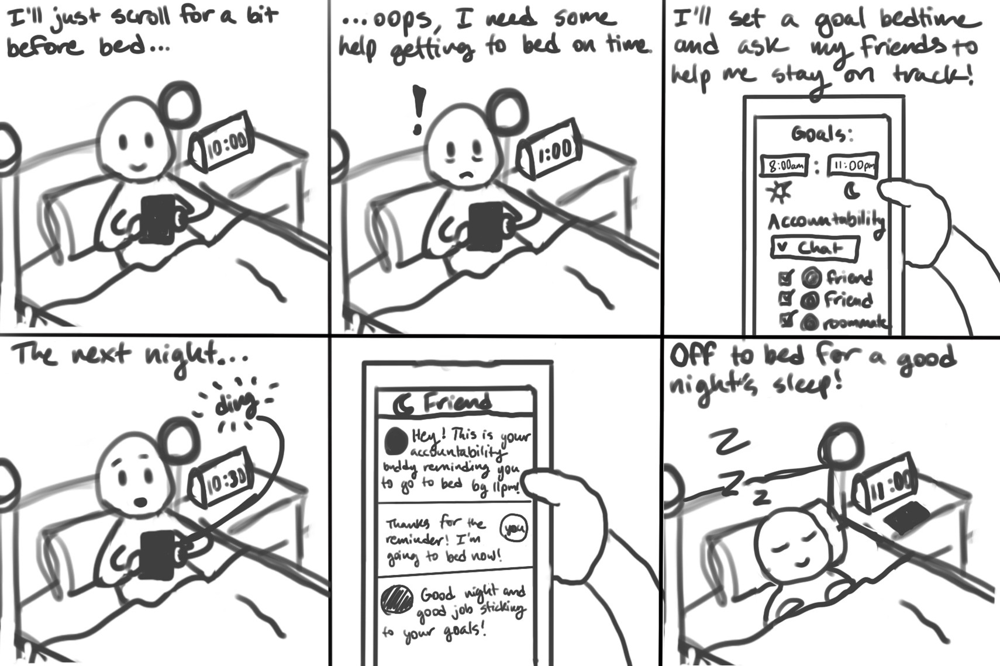
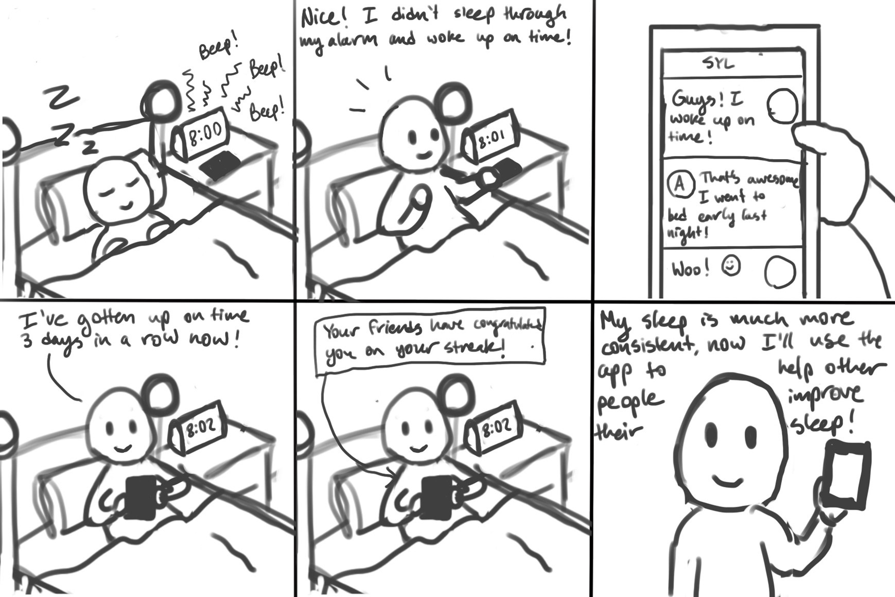
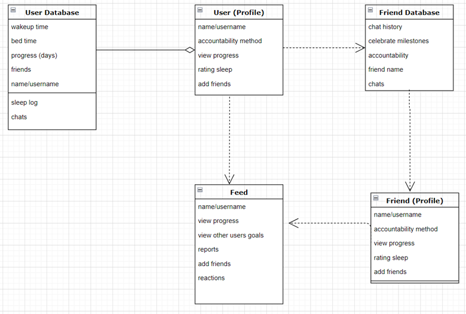

# Design Specification

The following is an overview of our design specifications for our prototype. 

## (1) Requirements
### Functional Requirements:
    Primary:
    ●	User will be able to create their own profile
    ●	User will be able to set their bedtime and wake-up time
    ●	User will be able to set accountability method 
    ●	User will be able to share their accountability method
    Secondary:
    ●	User will be able to chat with a friend/s
    ●	User will be able to add friends
    ●	User will be able to see a feed of their friends reports and goals about sleep
    ●	User will be able to reacted to chat messages with emoji reactions
    ●	User will be able to view their friends profile
    ●	User will be able to set alarms through the app and track snoozed/missed alarms
    ●	User will be able to connect to other APIs for accountability
    ●	User will be able to report/rate their sleep such as a log

### Technical Requirements:
    Primary:
    ●	Application should be able to save information about the user in a database in the backend
    ●	Application will make use of an API to integrate messaging functionality
    ●	Application will be able to connect with other users through backend 
    ●	Application will be able to send automated notifications and reminders
    Secondary:
    ●	Application will be made into mobile application with the use of an API through provided by Android Studio or another source to integrate messaging functionality
    ●  	Application will utilize existing social media frameworks and APIs to create an interactive, shared feed with connected users
    ●	Application will connect to secondary applications like an alarm app or venmo to send and receive information
    ●	Application will save user profile information in the backend that will be accessible and viewable by other users
    ●	Application will save user information about their sleep and how they rated it in a backend database

### Usability Requirements:
    Primary:
    ●	Flow of screens is intuitive 
    ●	The application will flow in a way that minimizes the amount of time that the user is on it
    ●	Buttons will be placed in a consistent place to make it easier to navigate through the application
    Secondary:
    ●	Users will be able to see other users reactions to their sleep through the feed
    ●	System will support mobile users

## (2) Storyboard

## (3) Architectural Design

The architectural design drawing shows the basic outline for how the system will store a user profile, a friend profile, and how they will interact with each other. The User has basic information and has a respective database that will keep track of their sleeping progress. A Friend profile (essentially another User) will have the same functionality, but we will be able to store their chat history between the two users, as well. We will also have a separate Feed that stores information across users that includes different milestones, sleep progress, and will allow users to communicate and react with others.

## (4) Write Up

Our architectural design is set up to allow for connectivity between a user and their friends in order to allow for the person-to-person accountability we show in the storyboard. Like seen in the story, the user stores their sleep schedule and goals in the User Profile which corresponds to our primary requirements, which would be saved and used to connect to the chats of other users, or Friend Profiles. As the user uses the chatting accountability method in the app to wake up and go to bed on time, they can communicate with the Friend Profiles through the chat more, or they can upload general status updates to the Feed. As shown in the architectural design, these two methods are both options of connecting the initial user profile to other “friend” profiles and accomplishing our primary functionality requirements of being able to share accountability over bedtimes and wake up times with other users.