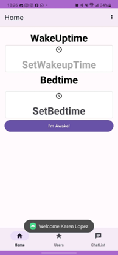
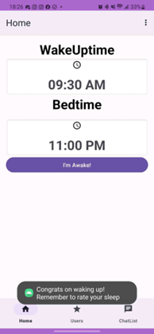

# User Testing

## Overview  

In preparation for our user testing session, the functionalities that we implemented were signing in as a user with the firebase authentication, setting a wakeup time and bedtime and the chat function where two users are able to chat with each other. We also have a half implemented awake button that when the user clicks the button a message pops up saying congratulations on waking up and it has notified in your chats that you have woken up. However the functionality that actually notifies the other users was not yet implemented. As of the time of testing it only displayed a reminder banner letting the user know to interact with the other users.
The bulk of our code for these functionalities is located in the chat folder, MainActivity file, and the HomeFragment file, as well as their respective XML files The other functionalities were omitted in our application. Among those include setting an accountability type and the ability to friend other users.

## User Test Flow:

### Signing into the app:

### Setting a wake up time and hitting the button:

### Chatting with other users:

## Session Results

In our user testing session, we learned that some of the functionalities that we implemented were not as intuitive as we would like them to be. The first thing that we learned was that our UI is inconsistent, some of the colors did not match or were the wrong shade. We also were told that the spacing between components were too close to one another and needed to be separated more . Users were confused with our awake button since it was too close to the setting times making them think that the button was for saving the times and not for when you wake up. From this user feedback we have decided that the wake-up button will either be moved lower down on the home page or move it to a separate page. We also learned we needed to add a back button to return to a previous page since the users found it hard to go return to the previous page they were on. Users really like the chat functionality; the only thing was that they wanted there to be a way to make the chat be focused more on accountability then just a chatting app. Users wanted there to be more focus on the accountability of waking up and going to bed. We want to revise our app some more to keep with that focus and perhaps include instructions or an onboarding process to ease users into using the application. 

Overall, we have learned that the overarching idea works well and the set up between screens is intuitive. We want to keep the overall functionality of the prototype however we want to move around where everything within the pages will go to create an easier user experience. Our idea for the application is to encourage consistent sleep habits therefore we want to make sure that everything on the app has easy access so that they spend less time on it. 
The next functionalities we will be focusing on are, setting accountability methods and users being able to share their accountability method. We also want to expand on user profiles so that the user can update their profile with their wake up and bedtime and accountability methods. 
