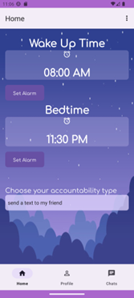
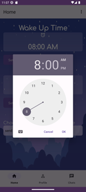
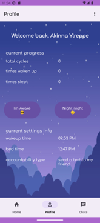
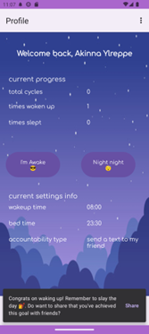
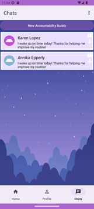
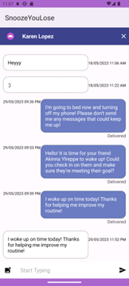

# Digital Prototype

## Our Mission

A consistent sleep schedule is a crucial part of a healthy lifestyle, but it can be hard for people to stick to new routines. It can be too easy to stay up late scrolling on social media or hitting snooze a few too many times without outside accountability. We noticed that many young adults that are university students and in the workforce struggle with consistent sleep habits. This is why we developed the mobile app Snooze You Lose. Snooze You Lose is an app that encourages users to build better sleep habits with the help of their friends.

A crucial aspect of our mission is for users to get consistent sleep. Therefore we wanted to focus our design to help minimize the amount of time the user is on the app. We designed this by creating three main pages: a home page, profile page and chat page. For the home page and profile page we decided to not add a scrolling function to minimize the amount of scrolling the user would need to do. Since there is no scrolling on these two pages the user is able to navigate quickly to the functionalities that they need and then they can get their rest or seize the day. Additionally, users can set their wakeup time, bedtime, and set their respective alarms on the home page along with their accountability types. This way, users have all of their dynamic settings in one place and can easily update their information. These settings would automatically be updated in a Firebase database under their user account. The profile page includes information about their bedtime, wakeup time, and accountability which is read from the database. It also displays Current Progress for the user so that they could track how many times they woke up on time and went to sleep on time. The total cycles stat indicates how many times a user went to sleep and woke up at time. There are also 2 buttons on the page: I’m Awake and Night Night. The I’m Awake button updates the Times Woken Up stat and has the option once pressed to notify users that you have chatted with before that you woke up on time. With the Night Night button, pressing it updates the Times Slept stat and you can share with users you chatted with that you are going to sleep and to avoid messaging them. These buttons increase the counts stored on the database and the option to share is presented, which adds a new chat message sent from the user’s account to other friends they are chatting with.

## Overview of App Functions

### Setting a timer on the home screen

 

### Hitting the “I’m Awake” Button on the Profile Screen

### Opening a chat from the Chats Screen                    

 

## Technical Issues

While implementing our app we did come across technical issues. One of the technical issues that we had was with the alarm notification using AlarmManager. We were able to set an alarm and have the notification go off, however it did not go off at the selected time. We tried many different implementations, and it took many days to debug and luckily we were able to achieve this goal. Now our application can send notifications at the time that the user selects. A technical issue that came up was understanding how to implement the Firebase database with our application. Reading and writing to the database took a long time to figure out and many different approaches. Additionally, having conditional actions or only updating when there was an event made it even more complicated. Eventually, we found how to update and read from the database and have our current information stay on the application for things like the accountability, bedtime, and wake up time which we weren’t able to do previously.

An additional source of technical difficulties came from navigating between different activities and screens. Our main activity is our navigation dashboard, and each of our three main screens are fragments within that activity. So a lot of challenge came from figuring out how to return to the chat fragment from the chat activity instead of the home fragment which was our default. There were also issues with creating a button to add users, as navigating from the activity to add users to the chat activity initially caused data to be erased. These issues were solved by figuring out how to transfer information through extras added to Intents which allowed for a smoother transition between screens without any loss of information.

## Changes We Made

A pivot we made was related to our user and friends functionalities. We found that with Firebase it was difficult to keep track of and implement Friends within users. So, we needed to change how users interacted with each other. This is where the “accountabilibuddy” system came into play where users could chat with each other to become buddies. Another pivot we had to make is related to the accountability types. Unfortunately, due to time constraints, we were unable to implement other accountability types to be automatic for users (such as donating money, or calling other users) so we had to rely on personal and social accountability for those and they acted more like suggestions instead. The accountability type “text a friend” we were able to connect this to our chat. The way this works is that when a user chooses this accountability type when their set alarm goes off it will also send a message in the chat letting their friends know that they should be awake or be going to bed. This was the one accountability type we were able to do automatically for users. 

We have implemented a mobile application hence we do not have a link for users to be able to access or use the emulator. However, we do encourage that people [visit our GitHub]( https://github.com/UWSocialComputing/snooze-you-lose-code.git 
) to check out our code and run it through an Android Studio emulator.
