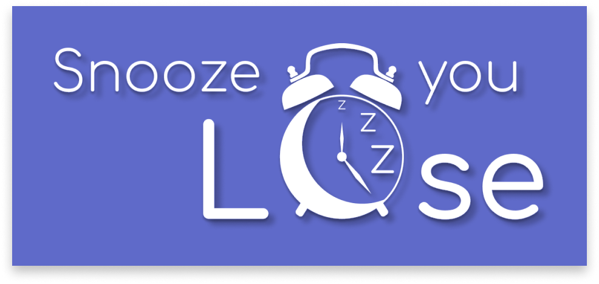

### Created by 
Karen Velderrain-Lopez (karenv16@uw.edu) | 
Basia Radka (basia@uw.edu) | 
Annika Epperly (epperann@uw.edu)

Hello! We're Snooze You Lose and we created an app to encourage better sleeping habits with the help of social accountability.

Feel free to explore our website to check out the process of designing and building our app. Additionally, you can visit [here](https://github.com/UWSocialComputing/snooze-you-lose-code) to check out the code behind the finished app. You can also check out our demo video [here!](https://www.youtube.com/watch?v=YP3l0xz-dUo)

Our app helps build consistent sleep habits. You can set your own wake up and bed times, set alarms, and set an accountability type to have friends help keep you accountable. You can view and share your progress within the app, too!
